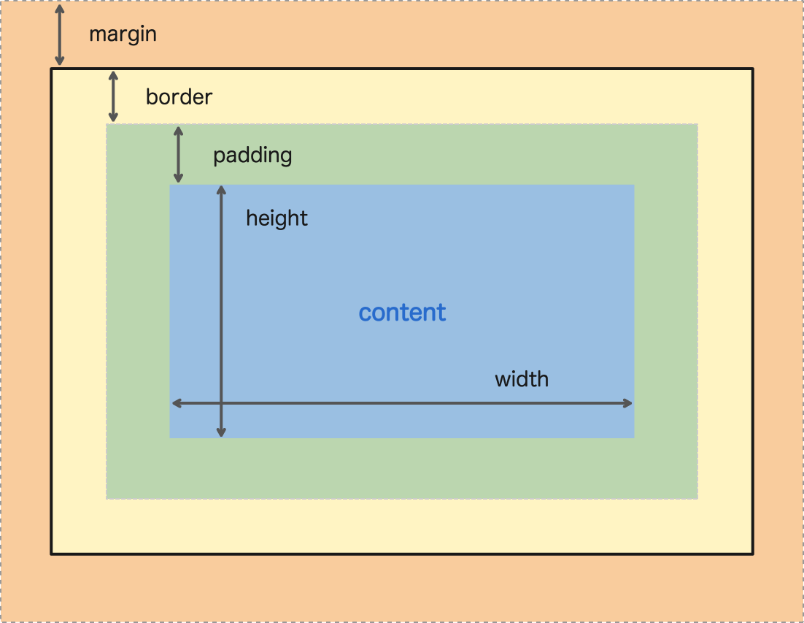

# CSS
Introdução

---
## O que é CSS?

- Apresentação visual para o cliente

- Estilos para o HTML

- Cascading Style Sheets

Folha de Estilo em Cascata

---
## IFRAME
<iframe src="https://www.fronteditor.dev" frameBorder="0"></iframe>

---
## Box Model

- Tudo são caixas

- Caixas possuem determinadas propriedades, veja

---
## Box Model

